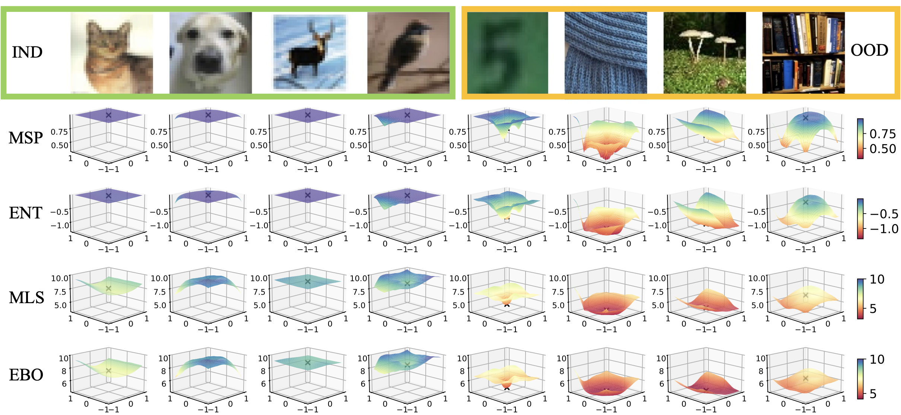

# Leveraging Perturbation Robustness to Enhance Out-of-Distribution Detection
[Accpeted in CVPR 2025.](https://cvpr.thecvf.com/virtual/2025/poster/32402). | [ArXiv](https://arxiv.org/html/2503.18784v1)

[Wenxi Chen](https://www.linkedin.com/in/wenxi-chen/), [Raymond Yeh](https://raymond-yeh.com/), [Shaoshuai Mou](https://engineering.purdue.edu/AAE/people/ptProfile?resource_id=124981), [Yan Gu](https://www.thetracelab.com/ygu.html)


This is the official implementation for the method Perturbation Rectified Out-Of-Distribution (PRO) Detection.  

## Paper Overview
In this work, we propose a post-hoc method, Perturbation-Rectified OOD detection (**PRO**), based on the insight that prediction confidence for OOD inputs is more susceptible to reduction under perturbation than in-distribution (IND) inputs.

<div align="center" style="width: 600px; height: 400px; overflow: hidden;">
  
  <p><strong>Figure 1:</strong> Landscape of score function differs between IND and OOD inputs.</p>
</div>

Based on the observation, we proposed an adversarial score function that searches for local minimum scores near original inputs by applying gradient descent. 

<div align="center">
  
  <p><strong>Figure 2:</strong> PRO algorithm pipeline.</p>
</div>

The perturbation procedure enhances the separability between IND and OOD samples.

<div align="center">
  
  <p><strong>Figure 3:</strong> Perturbation minimizes OOD scores while keeping IND scores invariant.</p>
</div>

Our approach further pushes the limit of softmax-based OOD detection and is the leading post-hoc method for small-scale models. On a CIFAR-10 model with adversarial training, PRO effectively detects near-OOD inputs, achieving a reduction of more than 10% on FPR@95 compared to state-of-the-art methods.

<div align="center">
  
  <p><strong>Figure 4:</strong> OOD detection performance on CIFAR-10 near-OOD.</p>
</div>


## Code Implementation
The repository is modified from the code of two benchmarks: [OpenOOD](https://github.com/Jingkang50/OpenOOD) and [RobustBench](https://github.com/RobustBench/robustbench). For detailed instructions on using these packages, please refer to their original GitHub pages.

---


## Installation

We recommend using **Python version >= 3.10** to ensure compatibility with both benchmarks. To set up the environment, run the following commands:

```
#within the repository path
pip install -e . 
cd robustbench 
pip install -e .
cd .. 
```
**Note**: If you do not intend to test adversarially robust models under OpenOOD, installing the RobustBench package is not required.

---

## Perturbation-Rectified OOD Detection

The proposed methods are implemented under the directory `openood/postprocessors`. The four methods presented in the paper correspond to:
- PRO-MSP: `pro2_msp`
- PRO-MSP-T: `pro2_tempscale`
- PRO-ENT: `pro2_ent`
- PRO-GEN: `pro_gen`

The primary difference between `pro2` and `pro` versions is that the `pro2` version includes the minimization step described in the paper, which helps stabilize performance. PRO-GEN has only implemented version with minimization.

Hyperparameter search configurations can be found in `configs/postprocessors`.

---

## Model and Test Data Download

For downloading test data, please refer to `scripts/download/download.py`. OpenOOD also provides detailed instructions on their [webpage](https://github.com/Jingkang50/OpenOOD). To download all test data, run the following command:

```
python ./scripts/download/download.py
--contents 'datasets' 'checkpoints'
--datasets 'all'
--checkpoints 'all'
--save_dir './data' './results'
--dataset_mode 'benchmark'
```
Pretrained adversarially robust models from RobustBench will be automatically downloaded before testing when running the test scripts.

---

## OOD Detection Test

To run OOD detection tests, refer to the shell scripts located in the `scripts/` directory. Our customized test scripts are named as `testall_...`.

The script `eval_ood_aarobust.py` loads pretrained adversarially robust models for OOD detection tests. An example usage in the shell script is like:
```
ulimit -n 4000 
CUDA_VISIBLE_DEVICES=0 python scripts/eval_ood_aarobust.py \ #remove the cuda setting accordingly
    --id-data cifar10 \
    --modelid Diffenderfer2021Winning_LRR\
    --postprocessor pro_gen \
    --batch-size 20 \
    --threat corruptions \
    --save-score --save-csv\
    --savekeyword _step1_0.0005
    #--overwrite
```
`ulimit` setting might not be needed for datasets besides ImageNet, please change the cuda prefix to allocate the computation accordingly. 

To test different baselines, modify the postprocessor name in each shell script. For robust model, their model IDs are listed in the [RobustBench](https://github.com/RobustBench/robustbench). The key modification to include robust models is to enable returning features in model's forward functions. If you intend to include additional robust models from RobustBench and test baselines that involve feature information (e.g., Scale or VIM), you need to modify the network definition in the following files: `robustbench/robustbench/model_zoo/cifar10.py`,`/cifar100.py`, or `/imagenet.py`. Make sure to adjust the model code accordingly to support feature extraction.
So far we have modified following robust models to enable returning features:
- Cifar-10, Common corruptions:
    - 'Diffenderfer2021Winning_Binary' 
    - 'Kireev2021Effectiveness_RLATAugMix'  
    - 'Diffenderfer2021Winning_LRR_CARD_Deck' 
    - 'Diffenderfer2021Winning_Binary_CARD_Deck' 
    - 'Diffenderfer2021Winning_LRR' 
    - 'Hendrycks2020AugMix_ResNeXt'
- CIFAR-100, Common corruptions:
    - 'Diffenderfer2021Winning_LRR_CARD_Deck'
    - 'Diffenderfer2021Winning_Binary'
    - 'Hendrycks2020AugMix_ResNeXt'
    - 'Diffenderfer2021Winning_LRR'
    - 'Diffenderfer2021Winning_LRR_CARD_Deck'
    - 'Diffenderfer2021Winning_Binary_CARD_Deck'
- ImageNet:
    - 'Erichson2022NoisyMix_new'
    - 'Geirhos2018_SIN_IN'
    - 'Hendrycks2020AugMix'
    - 'Salman2020Do_50_2_Linf'

---
